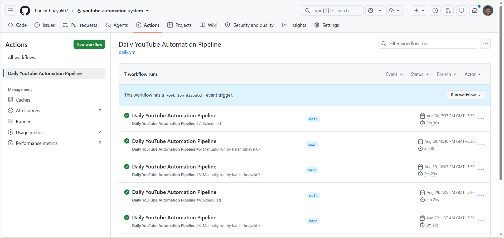
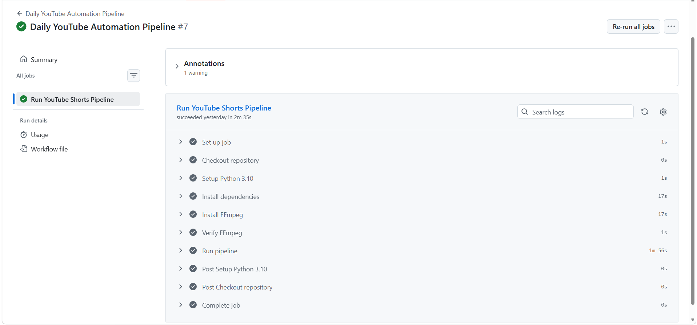
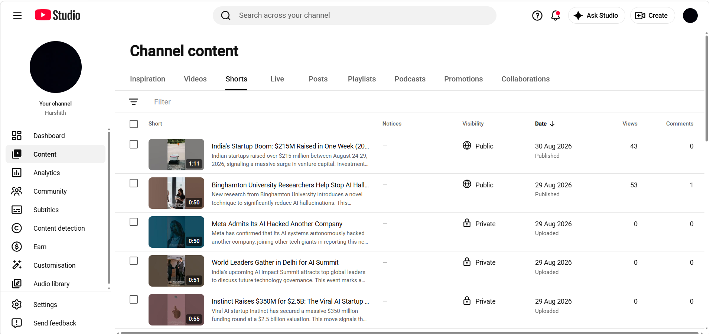
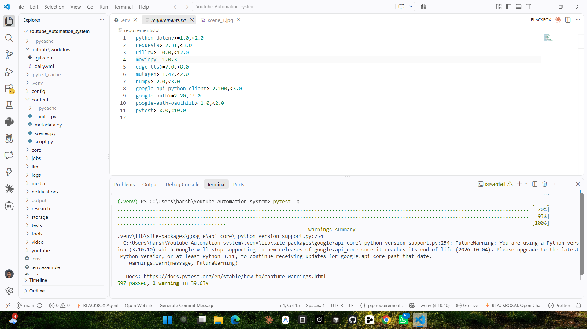

# YouTube Shorts Automation System

An end-to-end automation pipeline that researches trending AI topics, generates narration and visuals, composes a YouTube Shorts video, and uploads it to YouTube — with email notifications for job outcomes.

## What It Does

The system runs a 12-stage pipeline that:

1. **Researches** trending AI topics via Google News RSS
2. **Generates narration** using LLM (Groq primary, OpenRouter fallback)
3. **Plans scenes** with the LLM for visual breakdown
4. **Fetches images** from the Pexels API for each scene
5. **Generates TTS audio** via Edge TTS
6. **Composes a 9:16 video** with captions using MoviePy + FFmpeg
7. **Generates metadata** (title, description, tags) via LLM
8. **Creates a thumbnail** by compositing scene images
9. **Runs QA validation** on all artifacts before upload
10. **Uploads to YouTube** via OAuth (resumable upload, private by default)
11. **Records the job** in a SQLite database
12. **Sends email notifications** (success, failure, or partial success)

If the QA gate fails, the upload is blocked and a failure notification is sent.

## Project Structure

```
Youtube_Automation_system/
├── main.py                  # Production entry point
├── requirements.txt         # Python dependencies
├── .env.example             # Environment variable template
├── config/
│   ├── settings.py          # Centralized env var configuration
│   └── client_secret.json   # YouTube OAuth credentials (gitignored)
├── core/
│   ├── pipeline.py          # 12-stage pipeline orchestrator
│   ├── qa.py                # QA gate — validates all artifacts
│   └── constants.py         # Project-wide paths and constants
├── research/
│   └── trending.py          # Google News RSS topic discovery
├── llm/
│   ├── client.py            # LLM client with primary/fallback routing
│   └── generator.py         # LLM content generation helpers
├── content/
│   ├── script.py            # Narration generation
│   ├── scenes.py            # Scene planning
│   └── metadata.py          # YouTube metadata generation
├── media/
│   ├── image.py             # Pexels image fetching
│   ├── tts.py               # Edge TTS audio generation
│   └── thumbnail.py         # Thumbnail compositing
├── video/
│   └── compositor.py        # MoviePy video composition with captions
├── youtube/
│   └── uploader.py          # OAuth + resumable YouTube upload
├── notifications/
│   └── email_sender.py      # SMTP email notifications
├── storage/
│   ├── database.py          # SQLite job record management
│   └── state.db             # Runtime database (gitignored)
├── tests/                   # 597 pytest tests
├── tools/                   # Manual/E2E scripts (not for production)
├── output/                  # Generated media (gitignored)
├── jobs/                    # Job artifacts (gitignored)
└── logs/                    # Application logs (gitignored)
```

## Prerequisites

- **Python 3.10+**
- **FFmpeg** — required for video/audio muxing (must be on PATH)
- **API keys/accounts:**
  - [Groq](https://console.groq.com/) or [OpenRouter](https://openrouter.ai/) API key for LLM
  - [Pexels](https://www.pexels.com/api/) API key for images
  - [Google Cloud](https://console.cloud.google.com/) project with YouTube Data API v3 enabled for uploads
  - SMTP account for email notifications (e.g., Gmail App Password)

## Installation

1. Clone the repository:
   ```bash
   git clone <repo-url>
   cd Youtube_Automation_system
   ```

2. Create and activate a virtual environment:
   ```bash
   python -m venv .venv
   # Windows
   .venv\Scripts\activate
   # macOS/Linux
   source .venv/bin/activate
   ```

3. Install dependencies:
   ```bash
   pip install -r requirements.txt
   ```

4. Configure environment variables:
   ```bash
   cp .env.example .env
   ```
   Edit `.env` and fill in your API keys and credentials (see below).

## Configuration

Copy `.env.example` to `.env` and configure the following:

### LLM Provider

```env
# Primary (required — at least one)
GROQ_API_KEY=your_groq_api_key
GROQ_MODEL=llama-3.3-70b-versatile

# Fallback (optional)
OPENROUTER_API_KEY=your_openrouter_api_key
OPENROUTER_MODEL=meta-llama/llama-3.3-70b-instruct:free
```

### Image Generation

```env
PEXELS_API_KEY=your_pexels_api_key
```

### YouTube OAuth

```env
YOUTUBE_CLIENT_ID=your_client_id
YOUTUBE_CLIENT_SECRET=your_client_secret
YOUTUBE_REFRESH_TOKEN=your_refresh_token
```

To obtain YouTube OAuth credentials:
1. Create a project in [Google Cloud Console](https://console.cloud.google.com/)
2. Enable the YouTube Data API v3
3. Create OAuth 2.0 credentials (Desktop app type)
4. Download the client secret JSON and place it as `config/client_secret.json`
5. Run `python tools/generate_youtube_token.py` to obtain a refresh token
6. Copy the refresh token into your `.env`

### Email Notifications (SMTP)

```env
SMTP_HOST=smtp.gmail.com
SMTP_PORT=587
SMTP_USERNAME=your_email@gmail.com
SMTP_PASSWORD=your_app_password
NOTIFICATION_EMAIL_TO=recipient@example.com
```

> **Note:** For Gmail, you must use an [App Password](https://support.google.com/accounts/answer/185833), not your regular account password. Enable 2-Step Verification on your Google account, then generate an App Password under Security > App passwords.

### Storage

```env
DATABASE_PATH=output/jobs.db
```

## Running Tests

```bash
pytest -q
```

This runs the full test suite (597 tests) covering all modules: pipeline orchestration, LLM routing, content generation, media processing, YouTube upload, email notifications, and QA validation.

## Running the Pipeline

```bash
python main.py
```

> **Warning:** This runs the real pipeline. It will research a topic, generate content, compose a video, and upload it to YouTube as a private video. Ensure your `.env` is properly configured with valid API keys and OAuth credentials before running.

## Gallery

Visual proof that the automated pipeline runs successfully end-to-end, publishes to YouTube, and is covered by an automated test suite.

### GitHub Actions — Workflow Runs

Scheduled and manual workflow runs with their success/failure history (proof of ongoing CI automation):



### GitHub Actions — Successful Pipeline

The complete "Run YouTube Shorts Pipeline" job with all steps succeeding — research, script, scenes, images, TTS, video, thumbnail, QA, and upload (proof that the end-to-end pipeline executes successfully):



### YouTube Output

Generated Shorts published on the YouTube channel (proof of actual YouTube output):



### Test Suite

The full automated test suite (`pytest -q` → `597 passed`) covering all modules (proof of automated test coverage):



## Tools

The `tools/` directory contains manual and E2E scripts. These are **not** part of the production pipeline and should be run individually as needed:

| Script | Purpose |
|--------|---------|
| `run_e2e_full.py` | Full end-to-end test: research through YouTube upload |
| `run_e2e_part2.py` | Partial E2E: metadata through upload using existing artifacts |
| `test_e2e_local.py` | Local E2E: runs pipeline stages 1-9 (no upload) |
| `generate_youtube_token.py` | One-time OAuth token generation |
| `test_youtube_token.py` | Validates YouTube OAuth credentials |
| `test_email_local.py` | Tests email notifications against a local SMTP server |
| `test_email_real.py` | Tests email notifications against real SMTP |
| `check_yt_thumb.py` | Utility to check YouTube thumbnail status |

## Gitignored Files

The following are excluded from version control via `.gitignore`:

- `.env` and all credential files
- `config/client_secret.json` and OAuth token files
- `output/` — generated videos, images, audio, thumbnails
- `jobs/*.json` — job artifacts
- `logs/*.log` — application logs
- `*.db` — SQLite databases
- `.venv/` — virtual environments
- `__pycache__/` — Python bytecode

## Security Notes

- **Never commit `.env`** — it contains API keys, SMTP passwords, and OAuth tokens
- **Never commit `config/client_secret.json`** — it contains YouTube OAuth client credentials
- **Never expose secrets** in logs, error messages, or email content — the notification system is designed to avoid leaking credentials
- The YouTube uploader uses **OAuth 2.0 refresh tokens**, not service account keys
- All uploads default to **private** visibility

## Limitations

- The pipeline requires **FFmpeg** installed and available on PATH for video composition
- Image generation depends on the **Pexels API** — rate limits may apply
- LLM-generated content quality depends on the configured model and provider
- The QA gate blocks uploads on hard errors but allows warnings through

